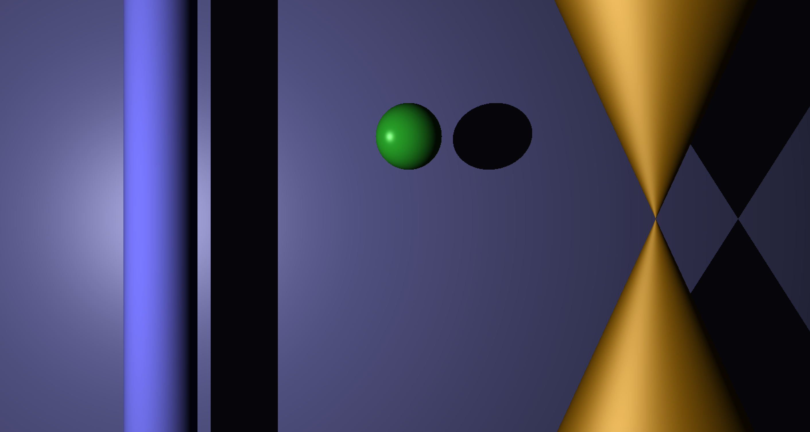
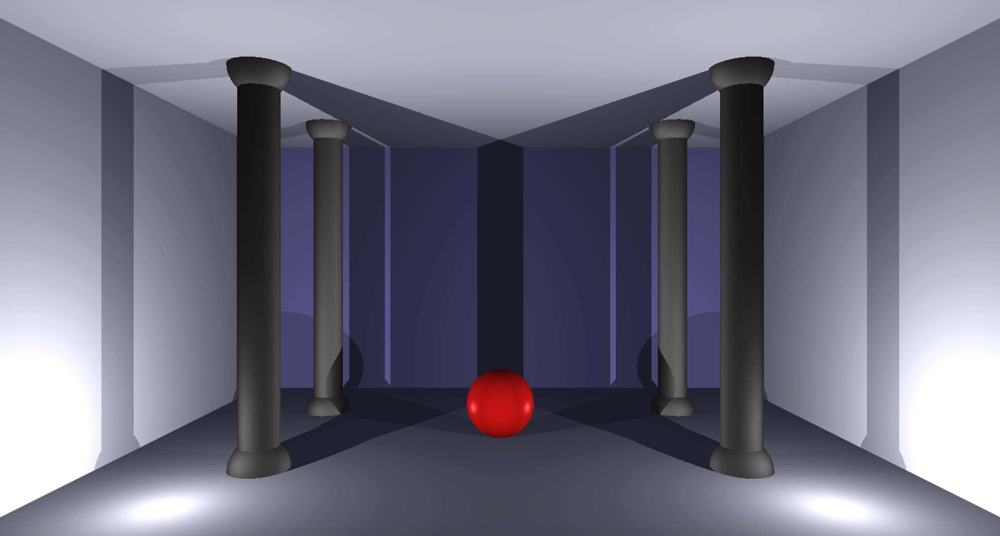
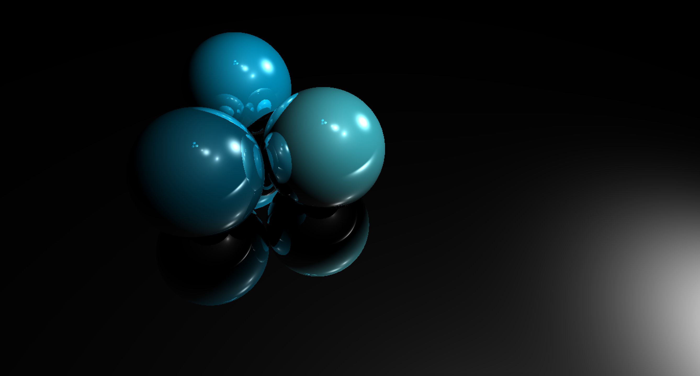
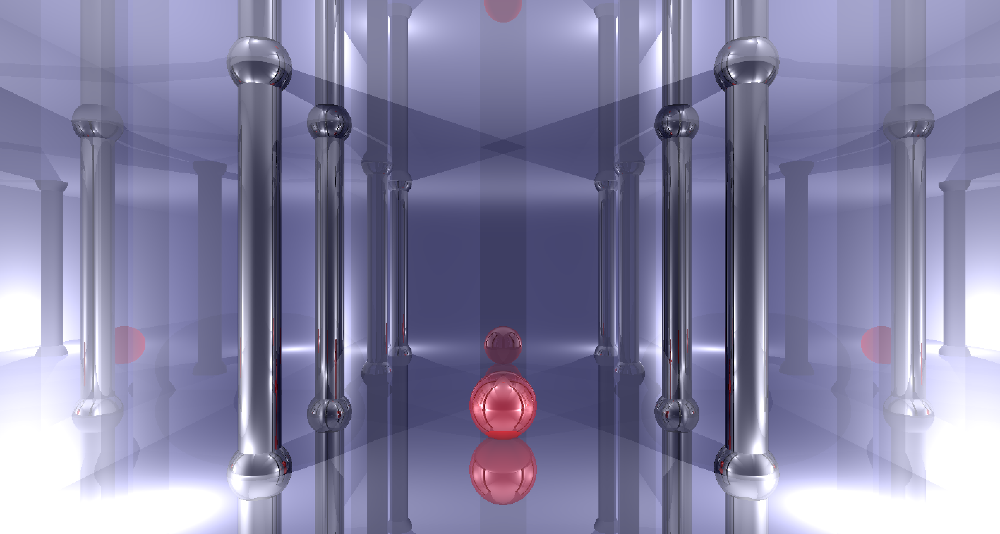

# RTV1 :

RTV1 is a basic RayTracer. It can read scene files written in XML and render them on screen.

## Primitives :
  - Sphere
  - Plane
  - Cylinder
  - Cone

## Effects :
  - Lambertian lighting
  - Phong lighting
  - Shadows
  
## Lights :
  - Point light
  - Directional light
  
# RT :

RT is a more complete RayTracer, taking RTV1 as a basis. Currently in development.

## Currently working on :
  - GTK User Interface
  - Reflection and Refraction

  
  
  
  
